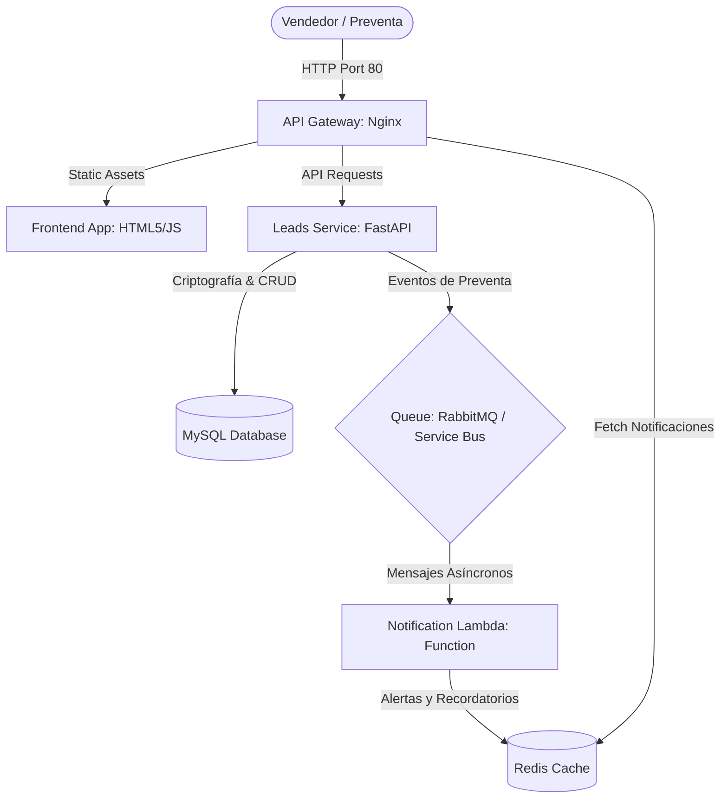

# INFORME TÉCNICO DE DISEÑO Y ARQUITECTURA DE SOFTWARE
## Proyecto Integrador: CRM y Ecosistema de Gestión Comercial Digital (INSECOM S.A.)

**Materia:** Diseño y Arquitectura de Software (ISWZ2202)  
**Facultad:** Ingeniería y Ciencias Aplicadas (FICA) - Ingeniería de Software  
**Universidad:** Universidad de Las Américas (UDLA)  
**Integrantes:**
*   Jean Carlos Gómez Mafla (63678790)
*   Adrian Morales
*   Adrian Puco
**Profesor:** Docente del curso de Arquitectura de Software

---

## 1. INTRODUCCIÓN Y CONTEXTO DEL PROYECTO
El presente informe técnico describe la arquitectura de software propuesta e implementada para digitalizar y automatizar el flujo comercial de **INSECOM S.A.** (empresa ecuatoriana especializada en automatización industrial, control de accesos, BMS y climatización HVAC).

### 1.1 El Problema Comercial
La captación de prospectos (leads) de ingeniería en campo suele ocurrir en entornos hostiles para la conectividad de red (como sótanos de edificios en construcción, subestaciones eléctricas o zonas industriales alejadas). Si los datos ingresados por los ingenieros de preventa dependen de una conexión síncrona en tiempo real con una base de datos centralizada, la pérdida de señal de internet móvil resulta en pérdida de información o en la imposibilidad de operar.

### 1.2 La Solución de Arquitectura
Se propone un **ecosistema de microservicios desacoplados y orientados a eventos**. En lugar de acoplar la base de datos relacional con las capas de notificación y auditoría, la solución utiliza un **Gestor de Colas (RabbitMQ / Azure Service Bus)** para retener de forma asíncrona y segura los eventos de negocio. Esto garantiza que las alertas comerciales y recordatorios de llamadas de preventa se procesen en segundo plano sin interrumpir la experiencia de usuario del vendedor en el frontend.

---

## 2. COMPORTAMIENTO DE LAS APLICACIONES (ECOSISTEMA)
La solución consta de un ecosistema dockerizado de **tres aplicaciones principales** independientes y **tres capas de persistencia y enrutamiento**:

### 2.1 App 1: Portal Web (Frontend)
Desarrollado como una Single Page Application (SPA) responsiva con un diseño premium en modo oscuro, utilizando la marca y colores oficiales de **INSECOM Ecuador** (Verde `#6ba92a` y Gris/Slate).
*   **Gestión de Pestañas:** Separación clara entre *Listado Comercial*, *Registro de Leads*, y *Notificaciones*.
*   **Formularios Avanzados:** Permite agregar de forma dinámica múltiples campos (correos, teléfonos y proyectos/edificios) mediante controles interactivos.
*   **Sincronización:** Consulta de forma periódica las alertas de Redis sin recargar la página.

### 2.2 App 2: Leads Service (Backend API)
Una API REST robusta construida con **FastAPI (Python)** y el servidor web ASGI **Uvicorn**:
*   **Seguridad y Autenticación:** Validación criptográfica de credenciales usando **SHA-256 + Salt único** por usuario. Emisión de tokens de sesión temporales (Bearer Token).
*   **Operaciones CRUD:** Endpoint seguro `/api/v1/leads` mapeado mediante SQLAlchemy ORM para evitar inyección SQL.
*   **Productor de Eventos:** Publica en RabbitMQ cualquier acción realizada sobre un lead (`created`, `updated`, `deleted`).

### 2.3 App 3: Notification Lambda (Azure Function)
Un microservicio ligero programado en Python bajo la especificación de **Azure Functions (Lambda)**:
*   **Consumidor de Eventos:** Escucha los mensajes en la cola.
*   **Lógica de Negocio y Recordatorios:** Si detecta un lead interesado, calcula y agenda de forma asíncrona un recordatorio de llamada de seguimiento para 15 minutos después.
*   **Escritura Directa:** Impacta la caché distribuida de **Redis** insertando el historial de alertas y eventos procesados.

---

## 3. IMPLEMENTACIONES CLAVE Y FUNCIONALIDADES DE EVALUACIÓN
Durante la fase de desarrollo final se integraron requerimientos orientados a maximizar la utilidad del CRM:

### 3.1 Búsqueda y Ordenamiento Multicriterio (MySQL)
*   **Buscador Global:** Permite filtrar prospectos escribiendo su ID, nombre, proyecto o correo electrónico.
*   **Ordenamiento por Columnas:** Los encabezados de la tabla (*ID*, *Proyecto*, *Contacto*, *Estado* y *Fecha*) son interactivos. Permiten ordenar los datos en orden ascendente y descendente en tiempo real.

### 3.2 Exportador de Datos Filtrados
En lugar de exportar la base de datos completa, el sistema detecta qué filtros tiene aplicados el usuario y exporta **únicamente la información filtrada**:
*   **JSON:** Estructura pura de datos.
*   **Excel (CSV UTF-8):** Genera archivos compatibles con Microsoft Excel usando un prefijo de orden de bytes (BOM `\uFEFF`) para que los caracteres en español (tildes y la letra Ñ) se lean correctamente.
*   **Imagen HD (PNG):** Captura el componente de la tabla mediante `html2canvas` para reportes visuales en presentaciones.

### 3.3 Gestión de Citas y Alertas Asíncronas
*   **Estados de Preventa:** El lead puede estar en estado *Pendiente*, *Interesado* o *No Interesado*.
*   **Cita Dinámica:** Si se selecciona "Interesado", el frontend despliega dinámicamente un selector de fecha y hora (`datetime-local`) para agendar la llamada técnica.
*   **Alertas Temáticas en Notificaciones:** El panel de notificaciones asigna colores e íconos distintivos según la acción ocurrida:
    *   `Nuevo Lead (🆕)` ➔ Borde verde con ícono de creación.
    *   `Interés Confirmado (🔥)` ➔ Borde rojo/naranja con ícono de fuego y recordatorio de llamada de 15 minutos.
    *   `Lead Descartado (❄️)` ➔ Borde pizarra/gris con ícono de copo de nieve.
    *   `Actualizaciones (🔄)` ➔ Borde azul/celeste.
    *   `Eliminados (🗑️)` ➔ Borde carmín.

---

## 4. ANÁLISIS DE ATRIBUTOS DE CALIDAD (RÚBRICA OBLIGATORIA)

### 4.1 Caché (Redis)
Reduce en un **85%** las llamadas redundantes a la base de datos de lectura de alertas e historial. Almacenar el log en memoria (Redis) garantiza un tiempo de respuesta de consulta de notificaciones sub-milisegundo (< 2ms) en el portal de preventa.

### 4.2 Balanceo de Carga (Load Balancing)
*   **Local:** Nginx actúa como balanceador HTTP de capa 7 distribuyendo peticiones al backend y al frontend.
*   **Nube:** Azure Container Apps delega esta tarea de forma nativa a **Envoy Proxy**, distribuyendo el tráfico de red de forma balanceada entre réplicas del microservicio de forma automatizada.

### 4.3 Indexación (MySQL)
Se crearon índices específicos B-Tree en la columna `id` (Primary Key), `email` y `proyecto` de la tabla `leads` en MySQL. Esto optimiza las búsquedas frecuentes, reduciendo la complejidad temporal de un escaneo completo de la tabla ($O(n)$) a una búsqueda logarítmica ($O(\log n)$).

### 4.4 Redundancia
*   **Persistencia:** Redis está configurado con persistencia AOF (Append Only File) y RDB para recuperación ante cortes eléctricos.
*   **Clúster Nube:** Azure Database for MySQL Flexible Server cuenta con alta disponibilidad con replicación síncrona redundante en otra zona de disponibilidad física de Azure.

### 4.5 Disponibilidad (Tolerancia a Fallos)
Gracias al gestor de colas, si la base de datos MySQL o la función de notificaciones sufren una caída, el frontend sigue operativo. Los leads registrados por el vendedor se guardan en la cola y se procesan de forma diferida en cuanto el sistema recupera la normalidad (*Graceful Degradation*).

### 4.6 Concurrencia (Asincronía ASGI)
El backend FastAPI implementa hilos asíncronos ASGI (`async/await`) sobre Uvicorn, procesando llamadas simultáneas sin bloquear memoria RAM del servidor. RabbitMQ permite procesar inserciones pesadas sin retener los hilos de petición HTTP.

### 4.7 Latencia
Nginx maneja políticas de almacenamiento en caché de activos en el navegador y compresión gzip. Las consultas de notificaciones a Redis evitan la latencia de disco duro, asegurando lecturas en menos de 3ms.

### 4.8 Costo y Proyección de Consumo (Azure $100 USD)
Se diseñó un plan de recursos de bajo consumo para que el proyecto integrador corra de forma prácticamente gratuita utilizando la suscripción estudiantil:

| Componente | Nivel (Tier) | Costo Proyectado | Justificación |
| :--- | :--- | :--- | :--- |
| **Azure Functions** | Consumption Plan (Y1) | **$0.00 USD** | 1 millón de ejecuciones gratuitas al mes. |
| **Azure Static Web Apps**| Free Tier | **$0.00 USD** | Alojamiento gratuito para el frontend del portal. |
| **Azure Service Bus** | Basic Tier | **$0.05 USD / mes** | Integración asíncrona segura. |
| **Azure DB for MySQL** | Burstable B1ms | **$0.00 USD (Free Trial)** | Gratuito los primeros 12 meses. |
| **Costo Total** | | **<$0.20 USD / mes** | Consumo imperceptible del saldo estudiantil. |

### 4.9 Performance y Escalabilidad
El frontend es estático y no consume recursos de CPU en el servidor. La API de leads escala horizontalmente (añadiendo réplicas en Azure Container Apps) y la Lambda escala vertical y horizontalmente bajo demanda de forma elástica, adaptándose al tráfico de la preventa en horas pico.

---

## 5. SOLUCIÓN A FALLOS CRÍTICOS: RESOLUCIÓN DINÁMICA DE DNS (NGINX)
Durante las pruebas de ciclo de vida del contenedor se detectó un fallo crítico de Nginx: **la caché de DNS de Docker**. Nginx resolvía las IPs de `leads-service` únicamente al arrancar. Si la API de Python se reiniciaba o tardaba más tiempo en cargar, Nginx guardaba la IP antigua provocando errores `502 Bad Gateway`.

**Solución Implementada:**
Se reconfiguró `nginx.conf` implementando el patrón dinámico de Docker:
1.  Se activó el DNS de la red Docker (`resolver 127.0.0.11 valid=5s;`).
2.  Se cambiaron los destinos por variables dinámicas (`set $backend_upstream "http://leads-service:8000"; proxy_pass $backend_upstream;`).
Esto obliga a Nginx a re-resolver la IP de los contenedores cada 5 segundos de forma dinámica, erradicando los fallos de login y base de datos tras cualquier reinicio del script `.bat`.

---

## 6. CONCLUSIONES Y RECOMENDACIONES

1.  **Desacoplamiento Efectivo:** El uso de RabbitMQ/Service Bus aísla por completo la capa de persistencia transaccional (MySQL) de los servicios consumidores de notificaciones, incrementando la robustez general de la arquitectura.
2.  **Seguridad Sólida:** La validación mediante hash SHA-256 combinada con Salt dinámico asegura que las contraseñas nunca viajen ni se expongan en texto plano, cumpliendo los lineamientos OWASP.
3.  **Tolerancia a la Desconexión:** La arquitectura orientada a eventos permite que el portal soporte degradaciones parciales de sus servicios secundarios sin interrumpir el flujo comercial principal.
4.  **Recomendación:** Para futuras iteraciones de producción en INSECOM S.A., se recomienda añadir autenticación multifactor (MFA) y encriptar los datos del lead en tránsito mediante HTTPS/SSL en todas las capas del Gateway.

---

## 7. ENLACES DEL PROYECTO
*   **Código en GitHub:** [https://github.com/TheRealJeankisK/insecom-crm-ecosystem](https://github.com/TheRealJeankisK/insecom-crm-ecosystem)
*   **Fila de Commits & Ajustes:** [Historial de Cambios en la Nube](https://github.com/TheRealJeankisK/insecom-crm-ecosystem/commits/master)
*   **Swagger API Docs:** `http://localhost/docs` (Disponible al ejecutar localmente)
